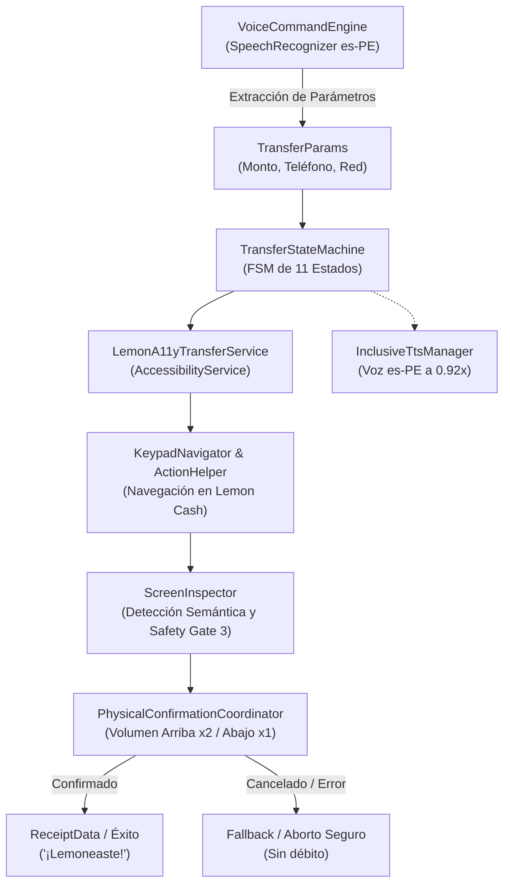

# 🍋 Lemon Asistente A11y (Accessibility & Voice Payment Assistant)

Asistente de accesibilidad inclusivo desarrollado para Android que permite a personas con discapacidad visual o motriz severa realizar pagos y transferencias de dinero en **Lemon Cash** de forma autónoma, fluida y segura.

---

## 🌟 Características Principales

- **Control por Voz Natural (Offline-ready):** Captura y extracción de comandos de voz mediante `VoiceCommandEngine` (reconocimiento de número de celular de destino, monto a transferir y red financiera como Yape o Lemon).
- **Navegación Autónoma Asistida (`AccessibilityService`):** Orquestación precisa mediante máquina de estados finitos (`TransferStateMachine`) que interactúa con la app Lemon Cash (`com.applemoncash`), navegando pantallas, seleccionando monedas y completando flujos sin requerir visión.
- **Teclado Topológico con Debounce (`KeypadNavigator`):** Mapeo semántico y matricial de teclados numéricos para ingreso seguro de PIN y montos con protección ante pérdidas de eventos táctiles.
- **Safety Gate 3 (Human-in-the-Loop Hardware Confirmation):** Bloqueo mandatorio de pantalla antes de la emisión final y confirmación física mediante botones de hardware (`PhysicalConfirmationCoordinator`):
  - **Subir Volumen (2 veces seguidas):** Autoriza y confirma la transferencia.
  - **Bajar Volumen (1 vez):** Cancela de inmediato la operación sin debitar fondos.
- **Síntesis de Voz Inclusiva (`InclusiveTtsManager`):** Locución en español (`es-PE`) a velocidad optimizada (0.92x) con lectura fonética de números telefónicos en tríadas y retroalimentación háptica diferenciada (vibraciones táctiles).
- **Almacenamiento Cifrado de Credenciales (`SecurePinStorage`):** Protección del PIN de acceso con `EncryptedSharedPreferences` y claves maestras AES-256 GCM en el Android Keystore.

---

## 🏗️ Arquitectura del Sistema

---

## 📱 Requisitos y Configuración

1. **Android:** Android 8.0 (API 26) o superior.
2. **Permisos Requeridos:**
   - Grabación de Audio (`RECORD_AUDIO`) para comandos de voz.
   - Servicio de Accesibilidad (`BIND_ACCESSIBILITY_SERVICE`) para automatización e interceptación de botones físicos.
   - Vibración (`VIBRATE`) para retroalimentación háptica.
3. **Configuración Inicial:**
   - Activar el servicio en: `Ajustes > Accesibilidad > Servicios Instalados > Lemon Asistente A11y`.
   - Guardar el PIN cifrado de 6 dígitos desde la interfaz principal de la aplicación.

---

## 🎨 Prototipo en Papel (Paper Prototyping)

El repositorio incluye el archivo [`paper_prototype.html`](paper_prototype.html), una maqueta completa en formato A4 lista para imprimir con wireframes, guías de evaluación para pruebas de usabilidad y piezas recortables (*cutouts*).
